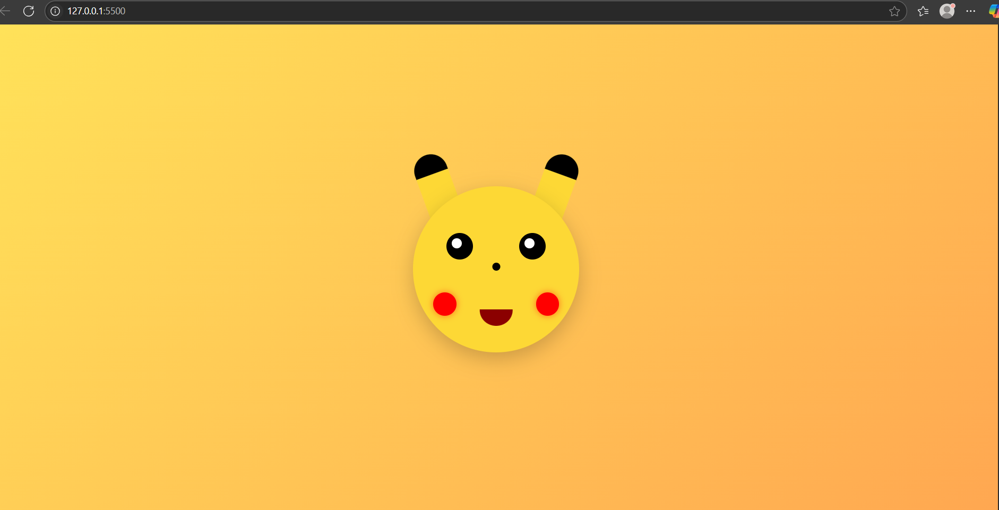

#  CSS Art – From Pikachu to Among Us Crewmate

This project is a pure **HTML & CSS artwork**, originally started with Pikachu, later improved to a more **realistic Among Us Crewmate** due to submission feedback in the **CSS Art Festival Challenge (800 pts)**.

No images, SVGs, or JavaScript — only HTML elements and CSS magic!

##  Change Log

| Version | Character    | Status      | Notes                             |
|---------|--------------|-------------|-----------------------------------|
| v1      | Pikachu      | ❌ Rejected | Lacked realism                    |
| v2      | Among Us     | ✅ Accepted | Recreated with more accuracy      |

##  Final Project – Among Us Crewmate

- **Realistic crewmate** with visor & backpack
-  Pure HTML + CSS (no image assets)
-  Gradients and shadows for depth
- Fully responsive and centered layout

[Among Us Preview](screenshot_amongus.png)

 [Live Demo](https://github.com/RishabhRanjanmiw/css-art-pikachu)

## Tech Stack

- HTML5
- CSS3 (Flexbox, Gradients, Border Radius, Positioning)

## Original Pikachu Art (Archived)

While the Pikachu design was visually fun, it didn't pass challenge standards for realism:

> Built for the CSS Art Challenge — 100% hand-coded for fun & creative flexing 

